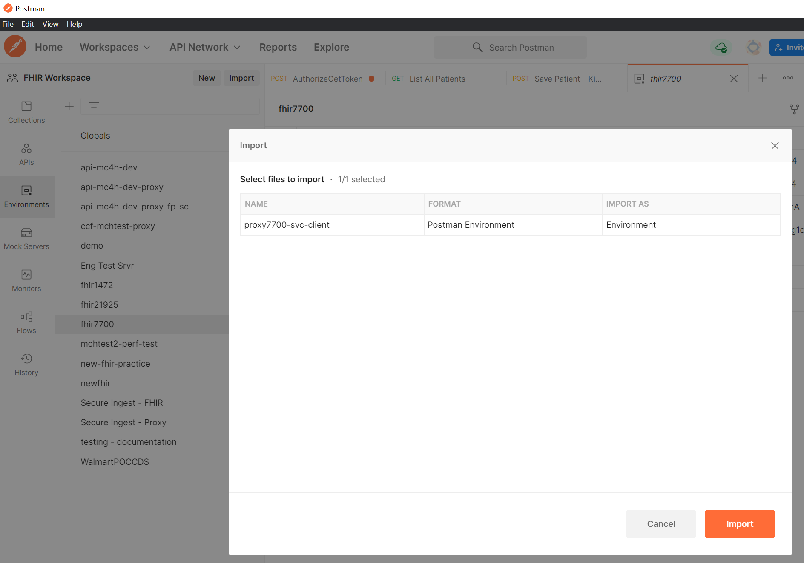

# Challenge 1 - Deploy Azure API for FHIR and FHIR-Proxy (OSS)

## Introduction

Welcome to Challenge 1!

In this challenge, you will deploy both **Azure API for FHIR** (PaaS) and **FHIR-Proxy** (Open Source Software).

## Background
FHIR (Fast Healthcare Interoperability Resources) is at the center of our healthcare products at Microsoft. Support for FHIR in Microsoft Cloud for Healthcare (MC4H) rests on two fundamental components: Azure API for FHIR and FHIR-Proxy. In MC4H architectures, Azure API for FHIR is at the center of FHIR data activity, and FHIR-Proxy acts as a checkpoint, filtering data and enforcing Role-Based Access Control (RBAC) at the FHIR Resource level.

## Learning Objectives 
+ Understand the prerequisites for deploying Azure API for FHIR and FHIR-Proxy
+ Become familiar with the Azure API for FHIR and FHIR-Proxy deployment process
+ Understand the Azure API for FHIR - FHIR-Proxy relationship

### Azure API for FHIR and FHIR-Proxy Relationship
The FHIR-Proxy acts as a Pre- and Post- Processor for Azure API for FHIR.  FHIR-Proxy has its own Client Credential Auth Flow and adds a means of Role-Based Consent to Azure API for FHIR.

Component View of Azure API for FHIR and FHIR-Proxy.  _Larger image available [here](./media/component-view.png)_ 


## Prerequisites 
To help you set up your environment, we provide install scripts that gather information necessary for the proper deployment and configuration of Azure API for FHIR and supporting Open Source Software (OSS) components.

Before you run these install scripts, please make sure that you have the following permissions in your Azure environment:

+ **Azure Subscription Prerequisite:** User must have rights to deploy resources at the Subscription scope (ie Contributor role or Owner role).
+ **Azure Active Directory (AAD) Prerequisite:** User must have Application Administrator (built-in RBAC role) rights for the AAD tenant they are deploying into.

The install will fail unless both of these prerequisites are met.

## Getting Started
Deploying Azure API for FHIR. 
For this challenge, we will walk through these steps: 
- Login to Azure CLI (via the Portal or directly at shell.azure.com)
- Clone the FHIR-Starter repo 
- Execute the deployment scripts 
- Set up Postman 
- Test Authentication 

To begin the deployment process, **CTRL+click** (Windows or Linux) or **CMD+click** (Mac) on the "Launch Cloud Shell" button below to open the Azure Cloud Shell CLI in a new tab.

[](https://shell.azure.com/bash?target="_blank")

Select Bash as the operating environment.

## Step 1 - Azure API for FHIR deployment 
  
- Navigate to the FHIR-Starter repo (**CTRL+click** or **CMD+click** for new tab) https://github.com/microsoft/fhir-starter in your browser. 

- Review the main [Readme.md](https://github.com/microsoft/fhir-starter#fhir-starter) and the [Readme.md](https://github.com/microsoft/fhir-starter/blob/main/scripts/Readme.md) in the fhir-starter/scripts folder.  

- Clone the FHIR-Starter repo in your Azure Cloudshell environment.  
    ```azurecli-interactive
    git clone https://github.com/microsoft/fhir-starter.git
    ```

- Change the working directory to the ```./fhir-starter/scripts``` directory in the repo.  
    ```azurecli-interactive
    cd $HOME/fhir-starter/scripts
    ```

- Make the Bash scripts for deployment and setup executable.  
    ```azurecli-interactive
    chmod +x *.bash
    ```

- Execute the ```deployFhirStarter.bash``` script.  
    ```azurecli-interactive
    ./deployFhirStarter.bash
    ```

Be certain to click ```y``` (for "yes") when prompted to generate a Postman environment for Azure API for FHIR access.

Deployed Components 


__Note__  During the live MC4H OpenHack session, Resource Group names will be assigned. If you are performing the OpenHack on your own, you can use your own custom Resource Group name, or you can use the automatically-generated name provided in the install process. Whether you use a custom or automatically generated Resource Group name, make sure to take note of the name because you will need it later when installing additional Azure components.

## Step 2 - Set up Postman
Using the Upload / Download button in the Azure Cloushell interface, download the _$fhirServiceName.postman_environment.json_ file to your computer. 

Import the Postman Search Collection into Postman if you have not already done so.  
Go to (**CTRL+click** or **CMD+click**) https://microsoft.github.io/openhack-mc4h/Challenge-1.html#materials for the collection download.

Use the imported collection in Postman to test access to your FHIR Service.

_[Need help with Postman - try this (CTRL+click or CMD+click for new tab)](https://github.com/daemel/fhir-postman)_ 


## Step 3 - FHIR-Proxy (OSS) Setup  
- Navigate to the FHIR-Proxy repo (**CTRL+click** or **CMD+click** for new tab) https://github.com/microsoft/fhir-proxy in your browser. 
- Review the main [Readme.md](https://github.com/microsoft/fhir-proxy/tree/main/scripts#fhir-proxy-getting-startd-scripts-readme) and the [Readme.md](https://github.com/microsoft/fhir-proxy/blob/main/scripts/Readme.md) in the ./scripts folder.  
    
- Clone the Repo in your Azure Cloudshell environment.  
    ```azurecli-interactive
    git clone https://github.com/microsoft/fhir-proxy.git
    ```

- Change the working directory to the ```./fhir-proxy/scripts``` directory in the repo.  
    ```azurecli-interactive
    cd $HOME/fhir-proxy/scripts
    ```

- Make the Bash scripts for deployment and setup executable.  
    ```azurecli-interactive
    chmod +x *.bash
    ```

- Execute the ```deployfhirproxy.bash``` script.  
    ```azurecli-interactive
    ./deployfhirproxy.bash
    ```

Once the ```deployfhirproxy.bash``` script completes, run the ```createproxyserviceclient.bash``` script. 

- Execute the ```createproxyserviceclient.bash``` script.  
    ```azurecli-interactive
    ./createproxyserviceclient.bash
    ```

Be certain to click ```y``` (for "yes") when prompted to generate a Postman environment for FHIR-Proxy access.

Deployed Components 


## Step 4 - Grant Admin Access (Portal)
We purposely do not grant Admin Access in the ```createproxyserviceclient.bash``` script as not everyone has Application Administrator rights.  We will supply an "admin script" for this in the next release. In the meantime, here are the Azure Portal steps necessary to grant admin access. 

Log into the Azure Portal, and go to Azure Active Directory


Go to App Registrations and find the client created with the ```createproxyserviceclient.bash``` script


Select API Permissions on the left blade, then slect Grant admin consent for "your tenant name"


Grant Admin Consent 


Complete 


---
__Note__  During the live MC4H OpenHack session, Resource Groups names will be assigned. If you are performing the OpenHack on your own, you can use any Resource Group name. 

## Step 5 - Set up Postman with Proxy 
Using the Upload / Download button in the Azure Cloudshell interface, download the _$fhirServiceName.postman_environment.json_ file to your computer. 


Import the _environment file_ into Postman



Get a Token 


List Patients as a test 


## Challenge Success
+ Azure API for FHIR (PaaS) installed and available 
+ FHIR-Proxy (OSS) installed and able to communicate with Azure API for FHIR

## Troubleshooting 
Most often the problem is order of execution in that someone will get a token before Granting Authorization.  

Error 403 - Unauthorized 
Cause:  Token does not have the Reader & Writer Roles authorized 

Obtain a new Token 


Copy the Token from Postman 


Check the Token for Reader and Writer roles using https://jwt.ms 


If the roles are missing, the permissions grant was not saved, please re-do Step 4. 
