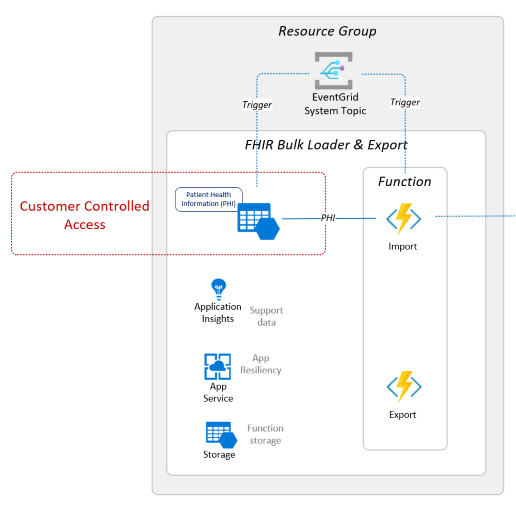

# Challenge-01 - Deploy Azure API for FHIR (PaaS), FHIR-Proxy (OSS), and FHIR-Bulk Loader (OSS)

## Introduction

Welcome to Challenge-01!

In this challenge, you will use an Azure Resource Manager (ARM) template to deploy **Azure API for FHIR** (PaaS), **FHIR-Proxy** (OSS), and **FHIR-Bulk Loader** (OSS). In addition, you will set up a **Postman** environment to make REST API calls to Azure API for FHIR.

## Background
FHIR (Fast Healthcare Interoperability Resources) is the standard format for health data storage and exchange in Microsoft's health data platform. Microsoft's FHIR infrastructure rests on two Azure components: [Azure API for FHIR](https://docs.microsoft.com/en-us/azure/healthcare-apis/azure-api-for-fhir/overview) (GA) and [Azure Healthcare APIs](https://azure.microsoft.com/en-us/services/healthcare-apis/) (currently in Public Preview). For this training, we will be focusing on Azure API for FHIR.

In Azure FHIR data architectures, Azure API for FHIR receives REST API requests from client apps and manages all FHIR data persistance and retrieval tasks. Meanwhile, the open-source [FHIR-Proxy](https://github.com/microsoft/fhir-proxy) acts as a checkpoint surrounding Azure API for FHIR, filtering the incoming and outgoing FHIR data according to a set of admin-defined rules.

For bulk ingestion of FHIR data into Azure API for FHIR, Microsoft offers the open-source [FHIR-Bulk Loader](https://github.com/microsoft/fhir-loader) utility. With FHIR-Bulk Loader, admins can easily import large amounts of FHIR data into Azure API for FHIR. The FHIR-Bulk Loader can import data from FHIR Bundles (compressed and non-compressed) as well as FHIR NDJSON files. 

## Learning Objectives 
+ Use an ARM template to deploy Azure API for FHIR, FHIR-Proxy, and FHIR-Bulk Loader
+ Understand the Azure API for FHIR - FHIR-Proxy relationship
+ Configure AAD authentication for FHIR-Proxy
+ Configure Postman for testing FHIR API calls

### Azure API for FHIR and FHIR-Proxy Relationship
In the Azure health data platform, FHIR-Proxy acts as a pre- and post- processor, selectively filtering FHIR data on its way into and out of Azure API for FHIR. Admins can set up FHIR-Proxy to listen to the stream of I/O data and trigger custom workflows based on specific FHIR events. FHIR-Proxy also brings enhanced Role-Based Access Control (RBAC) to Azure API for FHIR, allowing fine-grained Client Credential Authorization for REST API actions at the FHIR Resource level. This also provides a means of Role-Based Consent so that users (i.e., patients) can authorize or deny access to certain FHIR data.

Component View of FHIR-Proxy and Azure API for FHIR with AAD Service Principals as [confidential clients](https://docs.microsoft.com/en-us/azure/healthcare-apis/azure-api-for-fhir/register-confidential-azure-ad-client-app).


## Prerequisites 

Before deploying Azure API for FHIR, FHIR-Proxy, and FHIR-Bulk Loader, please make sure that you have the following permissions in your Azure environment:

+ **Azure Subscription:** User must have rights to deploy resources at the Resource Group scope in their Azure Subscription (i.e. [Contributor](https://docs.microsoft.com/en-us/azure/role-based-access-control/built-in-roles) built-in role).

+ **Azure Active Directory (AAD):** User must have [Application Administrator](https://docs.microsoft.com/en-us/azure/active-directory/roles/permissions-reference#application-administrator) rights for the AAD tenant attached to the Azure Subscription.


## Step 1 - Deploy Azure API for FHIR, FHIR-Proxy, and FHIR-Bulk Loader
In the first part of this challenge, you will
- Visit another repo and read the deployment instructions
- Go to the Azure Portal and begin the process for deploying Azure API for FHIR, FHIR-Proxy, and FHIR-Bulk Loader


To begin, **CTRL+click** (Windows or Linux) or **CMD+click** (Mac) on the link below to visit the fhir-starter quickstart repo (https://github.com/ToddM2/fhir-starter/tree/quickstarts/quickstarts) in a new browser tab.

Follow the instructions in the repo and return here when finished.

## What does success look like for Challenge-01?
+ Azure API for FHIR (PaaS) deployed and available
+ FHIR-Proxy (OSS) deployed and able to communicate with Azure API for FHIR
+ FHIR-Bulk Loader (OSS) deployed and available
+ Postman set up and able to make REST API calls to Azure API for FHIR

## Step 2 - Set up Postman
Next, you will set up your Postman environment so that you can make REST API calls to Azure API for FHIR.

## Using Postman to connect to Azure API for FHIR

1. [Download and install the Postman app](https://www.postman.com/downloads/) (if you haven't already).

2. [](https://god.gw.postman.com/run-collection/15998620-44558319-b188-4a0b-92f4-20e278cc6f6f?action=collection%2Ffork&collection-url=entityId%3D15998620-44558319-b188-4a0b-92f4-20e278cc6f6f%26entityType%3Dcollection%26workspaceId%3D39665fda-b424-466f-88ea-758306bb9d71)

   [](https://god.gw.postman.com/run-collection/15998620-d532e349-a060-4e62-84b1-b38691bc45ba?action=collection%2Ffork&collection-url=entityId%3D15998620-d532e349-a060-4e62-84b1-b38691bc45ba%26entityType%3Dcollection%26workspaceId%3D39665fda-b424-466f-88ea-758306bb9d71)

3. Click the ```Import``` button next to your workspace name. 

4. Import the ```$fhirServiceName.postman_environment.json``` file that you downloaded to your desktop environment (see top):
    + Add the file to Postman using the ```Upload Files``` button or paste in the contents of the file using the ```Raw text``` tab.
    

5. Import the ```FHIR-CALLS-Sample-postman-collection.json``` file that you downloaded to your desktop environment (see top):
    + Add the file to Postman using the ```Upload Files``` button or paste in the contents of the file using the ```Raw text``` tab.

6. Select the ```$fhirServiceName``` Postman environment in the workspace. (e.g. ```stocore``` as seen below is a Postman environment name).
   

7. Select the ```POST AuthorizeGetToken``` call from the ```FHIR CALLS-Sample``` collection.
   

8. Press ```Send```. You should receive a valid token automatically set in the ```bearerToken``` variable for the Postman environment.
   

9. Select the ```GET List Patients``` call from the ```FHIR CALLS-Sample``` collection.
   

10. Press ```Send```. You should receive an empty bundle of patients from Azure API for FHIR.
   
   
11. For your convenience, a sample Patient Resource is included in the ```POST Save Patient``` call. Select ```POST Save Patient``` and press ```Send``` to create a Patient Resource in Azure API for FHIR.  

12. Select ```GET List Patients``` again and press ```Send```. You should receive a JSON response with information about the sample patient you imported (see step 11).

13. Now you can experiment with other sample calls or your own calls.  

__Note:__ After token expiry (60 min), use the ```POST AuthorizeGetToken``` call again for a token refresh.


## Deployed Components 

Azure API for FHIR and FHIR-Proxy


FHIR-Bulk Loader




## Next Steps

Click [here](../Challenge-02/Readme.md) to proceed to the next challenge.
