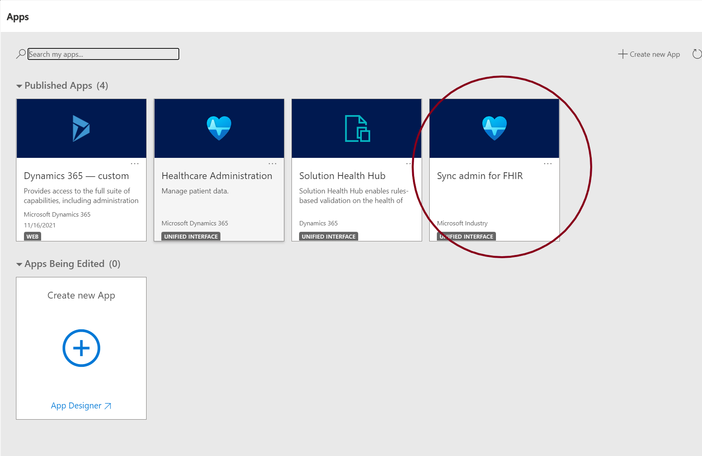
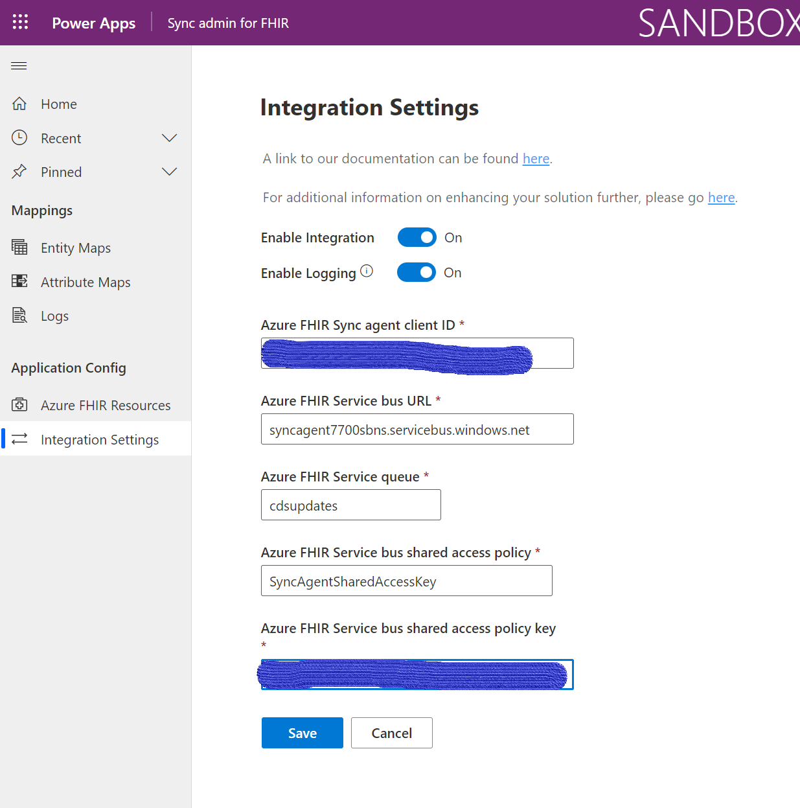

## SyncAgent Setup 

Once the setup script is complete, save the output and log into Dynamics, select the Sync admin for FHIR application 

Select Integration Settings and complete the information using the setup script output.

