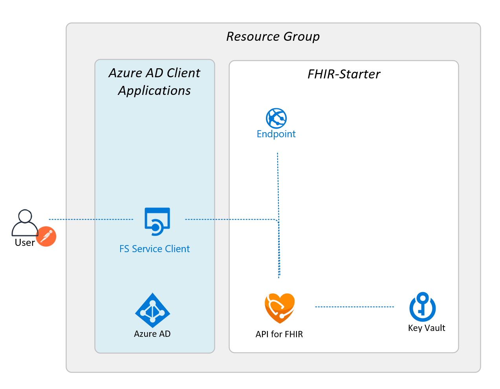

## Sample script execution 

dale@Azure:~/fhir-starter/scripts$ ./deployFhirStarter.bash
Executing ./deployFhirStarter.bash...
Checking Azure Authentication...

FHIR API Application deployment script...
 - Prerequisite:  Must have rights to provision Resources within the Subscription (ie Contributor)
 - Prerequisite:  Azure CLI (bash) access from the Azure Portal

The script gathers information then lets users choose to use a template or script deployment.  
Users without CLI Access can use the template deployment from the templates directory in this repo.  

Press Enter to continue, or Ctrl+C to exit

Collecting Azure Parameters (unless supplied on the command line)
Enter your subscription ID <press Enter to accept default> [de91991f-4607-4d0e-80fc-66a33f4e1681]:

This script will look for an existing resource group, otherwise a new one will be created  
You can create new resource groups with the CLI using: az group create  
Enter a resource group name <press Enter to accept default> [api-fhir-7700]:

If creating a *new* resource group, you need to set a location  
You can lookup locations with the CLI using: az account list-locations  
Azure API is currently availalbe in: East US, East US 2, North Central US, South Central US, West US, West US 2  
Enter resource group location <press Enter to accept default> [eastus]:
westus2
  
  Checking for existing Resource Group named [api-fhir-7700]...  
  Resource Group [api-fhir-7700] not found a new Resource group will be created  
---  
Collecting Script Parameters (unless supplied on the command line)..  
Enter your FHIR Service name <press Enter to accept default> [fhir7700]:  
  
  Checking for exiting FHIR Service named [fhir7700] ...Warnings can be safely ignored...  
WARNING: Command group 'config' is experimental and under development. Reference and support levels: https://aka.ms/CLI_refstatus  
WARNING: Command group 'healthcareapis service' is experimental and under development. Reference and support levels: https://aka.ms/CLI_refstatus  
  FHIR Service [fhir7700] not found, a new FHIR Service will be created  

Enter a Key Vault name <press Enter to accept default> [fhir7700kv]:  

  Checking for existing Key Vault named [fhir7700kv]...  
  Script will deploy new Key Vault [fhir7700kv] for FHIR Service [fhir7700]  
  
Do you want to generate a Postman Environment for FHIR Service access? [y/n]:
y  
 
Ready to start deployment of [fhir7700] with the following values:  
Subscription ID:....................... de91991f-4607-4d0e-80fc-66a33f4e1681  
Use Existing Resource Group:........... no  
Create New Resource Group:............. yes  
Resource Group Name:................... api-fhir-7700  
Resource Group Location:............... westus2  
Use Existing Key Vault:................ no  
Create New Key Vault:.................. yes  
KeyVault Name:......................... fhir7700kv  
FHIR Service Client Application Name:.. fhir7700-svc-client  
Generate Postman Environment:.......... yes  
  
Please validate the settings above before continuing  
Press Enter to continue, or Ctrl+C to exit  
  
Starting Deployments  
  
Creating Resource Group [api-fhir-7700] in location [westus2]  
  az group create --name api-fhir-7700 --location westus2 --output none --tags 'HealthArchitectures FHIRStarter'  
  
  
Creating Key Vault [fhir7700kv] in location [api-fhir-7700]  
  az keyvault create --name fhir7700kv --resource-group api-fhir-7700 --location westus2 --tags 'HealthArchitectures FHIRStarter' --output none  
  stepresult=  
  
Deploying FHIR Service [fhir7700]  
... note that warnings here are expected and can be safely ignored ...  
  
Creating FHIR Service [fhir7700] in location [api-fhir-7700]  
WARNING: Command group 'healthcareapis service' is experimental and under development. Reference and support levels: https://aka.ms/CLI_refstatus  
WARNING: Command group 'healthcareapis service' is experimental and under development. Reference and support levels: https://aka.ms/CLI_refstatus  
  
FHIR Service Audience set to [https://fhir7700.azurehealthcareapis.com]  
  
WARNING: Command group 'healthcareapis service' is experimental and under development. Reference and support levels: https://aka.ms/CLI_refstatus  
  
FHIR Service Resource ID set to [/subscriptions/de91991f-4607-4d0e-80fc-66a33f4e1681/resourceGroups/api-fhir-7700/providers/Microsoft.HealthcareApis/services/fhir7700]  
  
Creating FHIR Service Client Application [fhir7700-svc-client]  
WARNING: The output includes credentials that you must protect. Be sure that you do not include these credentials in your code or check the credentials into your source control.   For more information, see https://aka.ms/azadsp-cli  
WARNING: 'name' property in the output is deprecated and will be removed in the future. Use 'appId' instead.  
FHIR Service Client Application ID is [734dfac4-4830-458e-a66c-449ca1971494]  
  
Setting FHIR Service Client Object ID  
  
Saving FHIR Service Client Information (FS-name) to Key Vault [fhir7700kv]  
  
Granting FHIR Service Client Application FHIR Data Contributor Role  
  
Generating Postman Environment File  
  
The Postman environment [fhir7700.postman_environment.json] has been generated  
The environment file along with the FHIR-CALLS-Sample-postman-collection.json can be used to access [fhir7700]  
  
Download Files from Cloud Shell  
https://docs.microsoft.com/en-us/azure/cloud-shell/using-the-shell-window#upload-and-download-files  
  
Importing Postman files  
https://learning.postman.com/docs/getting-started/importing-and-exporting-data/#importing-postman-data  
************************************************************************************************************
Deployment of FHIR Service [fhir7700] and [fhir7700-svc-client] completed successfully  
The FHIR Service Client Application can be used for OAuth2 client_credentials flow authentication to the FHIR Server  
Client Credentials have been securely stored as Secrets in the Key Vault [fhir7700kv]  
The secret prefix is FS (for FHIR Service)  
************************************************************************************************************
dale@Azure:~/fhir-starter/scripts$  

---

## Deployment Architecture 

