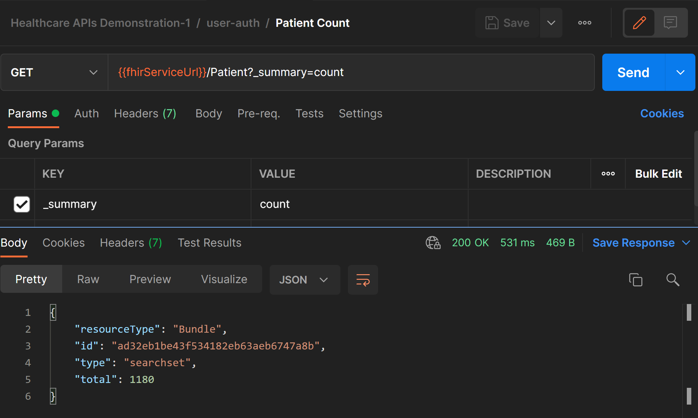
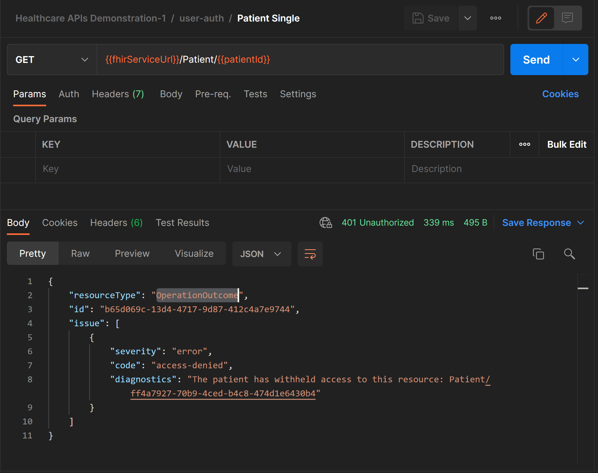

# Challenge 16 - Deploy and demonstrate the consent capabilities of Azure Healthcare APIs

## Introduction

In this challenge you will learn how to configure Consent Opt-Out filtering using the Secure FHIR Proxy solution.

## Background

In today's rapidly changing healthcare data landscape, the FHIR R4 format is fast becoming the HLS industry standard for storage and exchange of health data. Healthcare consumers expect that their directives related to privacy, treatment, research, and advanced care are respected.

## Learning Objectives

+ Configure Consent Opt-Out filtering in Secure FHIR Proxy
+ Add a Consent Resource to the Healthcare APIs FHIR service
+ Verify that Consent Opt-Out filtering performs as expected

## Prerequisites

+ Azure Healthcare APIs FHIR service instance with patient data
+ Secure FHIR Proxy service successfully deployed
+ Postman (https://www.postman.com/downloads/) or Visual Studio Code with the REST Client extension (https://marketplace.visualstudio.com/items?itemName=humao.rest-client)
+ Multiple Azure AD users to simulate user and or administrator access to the FHIR service. 

## Step - 1 Configure Postman

1. Configure postman using the guidance provided in [Challenge 1](../Challenge-1/Readme.md)
2. Confirm that the FHIR service contains Patient resources.

3. Select a Patient resource and record the patient identifier. This will be used to create the Consent resource 

Visual Studio Code with the [REST Client](https://marketplace.visualstudio.com/items?itemName=humao.rest-client) extension may also be used to complete this challenge. See the walkthrough [here](https://docs.microsoft.com/en-us/azure/healthcare-apis/using-rest-client) for details on how to use REST Client to access Healthcare APIs. Be sure to note that in all cases you will be using the Secure FHIR Proxy endpoint to complete this challenge.

## Step - 2 Post Consent Record to FHIR Service

1. Review and update as needed the sample Consent resource that may be found [here](./sample-data/consent-resource.json). Be sure to use the Patient resource obtained in Step 1 
2. Create a new request in Postman and post the consent resource

## Step - 3 Configure Secure FHIR Consent Opt-Out

1. Refer to the Secure FHIR Proxy configuration [documentation](https://github.com/microsoft/fhir-proxy/blob/main/docs/configuration.md) for additional details

## Step - 3 Verify Consent Opt-Out filtering

1. Link a user to an appropriate FHIR resource. See the Secure FHIR Proxy configuration [documentation](https://github.com/microsoft/fhir-proxy/blob/main/docs/configuration.md) for additional details. Ensure that the linked user is not assigned to the Secure FHIR Proxy administrator role.

2. Sample query patient result. 

## Challenge Success

+ Successfully POST a consent record to the Healthcare APIs FHIR service
+ Verify that Consent Opt-Out properly filters resources