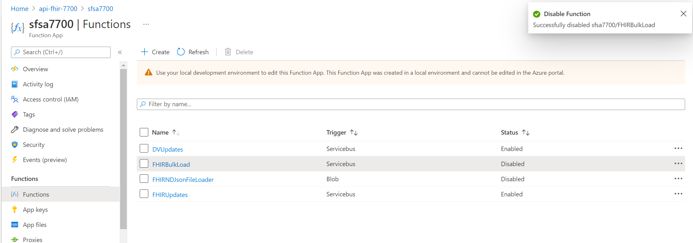

## Setup script output (part 2)

```
dale@Azure:~/fhir-cds-agent/scripts$ ./setupSyncAgent.bash
Executing ./setupSyncAgent.bash...
Checking Azure Authentication...

FHIR-SyncAgent Application setup script...
 - Prerequisite:  Azure API for FHIR must be installed
 - Prerequisite:  Microsoft FHIR-Proxy must be installed with KeyVault
 - Prerequisite:  Microsoft FHIR-SyncAgent deployment should be finished w/o errors (deploySyncAgent.bash)
 - Prerequisite:  Dataverse (a.k.a., CDS) Tenant and Application ID information is needed

 Information needed by this script
 - KeyVault Name installed with FHIR-Proxy
 - DV Instance URL... (URL of the Dataverse instance)
 - DV Tenant ID... (Dataverse Tenant ID),
 - DV Client ID... (Application ID of the Application made in the Dataverse Tenant)
 - DV Client Secret... (Application Secret of the Application made in the Dataverse Tenant)

Press Enter to continue or Ctrl+C to exit
Enter the FHIR-Proxy application name connected to the Azure API for FHIR [typically starts with sfp]:
sfp7700
Enter the resource group name where the FHIR-Proxy is installed  [typically the same as Azure API for FHIR]:
api-fhir-7700
Enter the keyvault name installed by FHIR-Proxy to store/retreive FHIR-CDS SyncAgent information [typically ends with numbers]:
fhir7700kv

   Checking keyVault [fhir7700kv] access and FHIR-Proxy values...
   ..... found [fhir7700kv]
   ...found FHIR-Proxy Host [sfp7700.azurewebsites.net]
   ...setting FHIR-Proxy App Name to [sfp7700]

Collecting the Dataverse Instance / Connection Information

Enter the Dataverse Instance URL - aka MC4H App URL (include the https://) []:
https://rpdev-fhirsyncagent-36423.crm.dynamics.com

Enter the Dataverse Tenant ID []:
096d1a84-d560-4fa0-b41f-e88d1e4e3cae

Enter the Dataverse Client ID []:
4132a7da-34b1-478d-8f25-1b467e17f630

Enter the Dataverse Client Secret []:
***

Gathering FHIR-SyncAgent information for use in the Dataverse Integration Settings (environment variables)
Checking for CDS variables in fhir7700kv...
...found CDS values in fhir7700kv...

Storing FHIR-Sync Agent and Dataverse settings in keyVault fhir7700kv...
Storing SA-FHIRMAPPEDRESOURCES in keyVault...
Storing SA-CDSAUDIENCE in keyVault...
Storing SA-CDSTENANTID in keyVault...
Storing SA-CDSCLIENTID in keyVault...
Storing SA-CDSSECRET in keyVault...

----------------------------------------------------------------------------------------------------------------
 Secure FHIR-SyncAgent application configuration settings are stored in KeyVault: [fhir7700kv]
----------------------------------------------------------------------------------------------------------------

----------------------------------------------------------------------------------------------------------------
 You need the following information to configure Dataverse Integration Settings in MC4H FHIR Sync Administration
 - Service Bus URL:  syncagent7700sbns.servicebus.windows.net
 - Service Queue:  cdsupdates
 - Service Bus Shared Access Policy:  SyncAgentSharedAccessKey
 - Service Bus Shared Access Policy Key: *** 
----------------------------------------------------------------------------------------------------------------

****************************************************************************************************************

dale@Azure:~/fhir-cds-agent/scripts$

```

## Next Steps 

There is a known KeyVault + Function Issue where it will not ready Function Script variables, requiring a manual work around.  The work around is documented here:  https://github.com/daemel/fhir-cds-agent/tree/main/scripts#keyvault-issue-with-service-bus-manual-work-around

Please follow the instructions to implement the work around. 


## Performance & Monitoring Hint
Two function components are only needed for high performance (ie 1 off) bulk loading.  These can be disabled to reduce log traffic and save on costs 



---

## Deployment Architecture 


