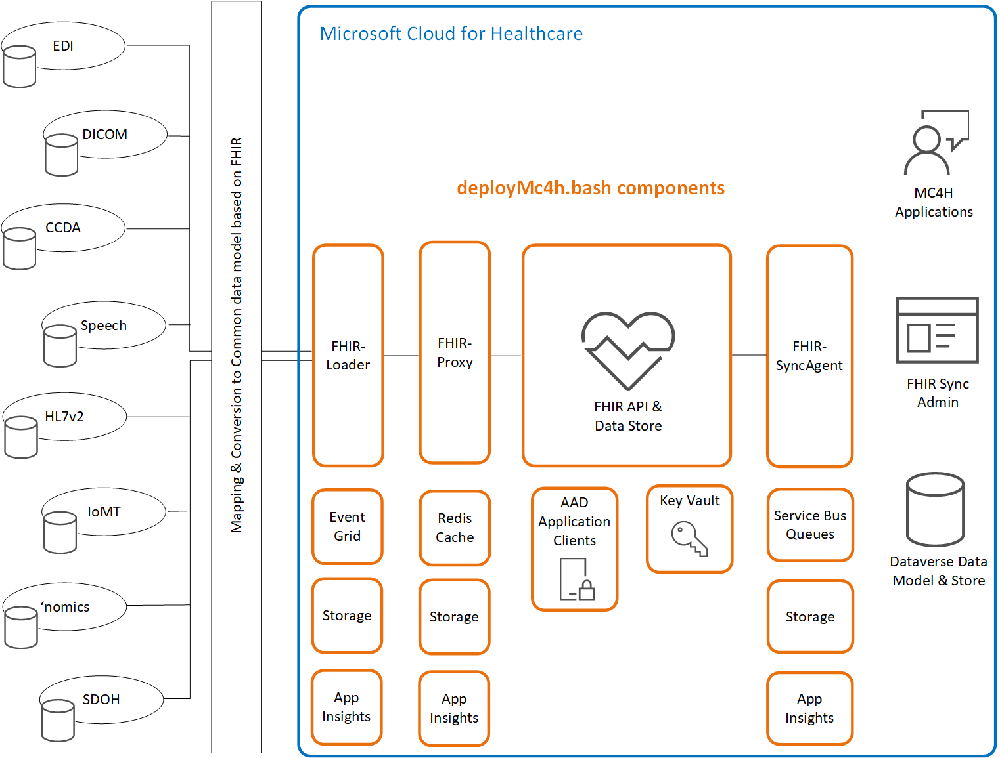

# Welcome to OpenHack for Microsoft Cloud for Healthcare
This OpenHack is designed to be self-service or it can be taught with an instructor.   

[View Repo on GitHub](https://github.com/microsoft/openhack-mc4h){: .btn }

### Overview 
This OpenHack is designed to help customers as they deploy Microsoft Cloud for Healthcare components.  How do the components work together, where do I find them and what data works with Microsoft Cloud for Healthcare are common questions that this hack will provide insights to.   

This OpenHack was designed with the product teams responsible for technologies such as the Azure API for FHIR, IoMT FHIR Connector for Azure, DICOM for FHIR, Dynamics, Power Platform and more. 

### Components  
Components used in this OpenHack 

### Support or Contact

We invite you to ask questions, make suggestions and share use cases which we might consider for future reference architectures or implementations, email us **@ <a href="mailto:HealthArchitectures@microsoft.com">HealthArchitectures</a>**

For more information on health solutions go to **[Azure for Health Cloud](https://azure.microsoft.com/en-us/industries/healthcare/)**. For more information regarding the Azure Fast Healthcare Interoperability Resource (FHIR) service for health data solutions go to **[Azure API for FHIR](https://azure.microsoft.com/en-us/services/azure-api-for-fhir/)**